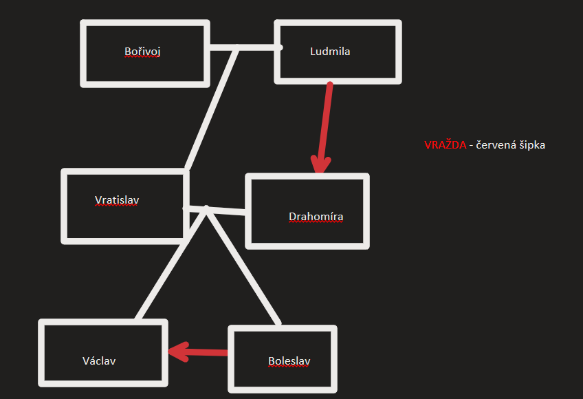

7.st. - 14.st.
Sámova Říše
* 7.st.
Velká Morava
* 9.st.
* 863 příchod Věrozvěstů Cyrila a Metoděje ze Sovoně
* Nechal je povolat kníže Rastislav, aby hlásali Křesťanství, který chtěl zabránit vlivu německa proto poslal právě je z řecka
* Přinesli Jazyk staroslověnštinu a písmo hlaholice
* Cyrilice - zjednodušená hlaholice, později základ azbuky
* Zformován první kulturský jazyk - díky tomu jazyk k bohoslužbám, mším, svatbám, pohřbech atd. - předtím probíhaly pouze v Latině, Prostý lid nerozuměl Latině. Latina pouze pro nejurozenější a nejchytřejší.
Staroslovenské texty
  * Kyjevské listy
w zlomek mešní knihy (mše)
  * Životopisy svatých
w Náboženské listy
  * Proglas
w veršovaný předzpěv k evangeliím
w Veršovaný předzpěv k Cyrilským metodějským misím - 5.července
10. - 11. století
  * Zápasí Latina a staroslovanština
  * Stát českých přemyslovců
Kristiánova Legenda
První přemyslovský rod:
  
w Vražda drahomíry od sv. Ludmily
w Poslání vraha na sv. Václava. Vrah, který ho zavraždil před kostelem, byl seslán Boleslavem
w umučení Václava a Sv. Ludmily, napsána v Latině
Hospodine Pomiluj mi
  * První duchovní česká píseň
  * Význam - smiluj se nad námi
Kosmas (decanus)
  * Hlas z dávných dob
  * Zastánce západního katolictví
  * Narozen 1045 v urozené rodině
  * Studoval v Lutichu
  * Gramatika a Dialektika
  * Svědek podání listiny Jindřicha IV.
  * Jel na Instituru (jmenování do církevních úřadů)
  * Nejdřív vyvědcen na kněze v Uhrách potom povýšen na děkana svatovícké kapituly
Kosmova Kronika (kronika česká)
w Je psána v latině
w Dochována v 15 rukopisech (opisech)
w Hodně z nich ztraceno nebo upáleno
w Na přelomu 11. a 12. století
w Počátky dějin českého národa
w Pochází z vyprávění bájných starců - vyslýchání příběhů a legend - ptal se proto, že se jich sám nemohl dožít
  * Zahálka - nepřítelkyně duše
Svatý Václave
  * Svatováclavský chorál
  * Ze 12.st.
  * druhá česká píseň - první čistě česká
Rozvoj Česky psané Literatury
* Přelom 12. - 15. st.
* Konhutina modlitba
  * Duchovní lyrika
* Alexandreis
  * Veršovaný epos o Alexandru Velikém
  * Objevem jeho zkutku
  * Vzor rytířských cností ve středověku
  * Přelom 13. -14. st.
* Dalimilova broučka 
  * Veršovaná
  * Shrnuje české dějiny do roku 1314
Doba Karlova
* Vládl (spravoval) Italské státy už v mládí
* 4 manželky
  * Alžběta Pomořanská (4.)
* Český Král a později i Římský císař
* 1348 - založil Univerzitu Karlovu
* Původně Václav, Na počest strýce ve Francii se přejmenoval na Karla
Eliška Přemyslovna
  * Matka Karla IV.
Jan Lucemburský
  * Otec Karla IV.
  * Zemřel ve stoleté válce u Kresčaku
* Vitae Caroli
  * Deníček Karla - autobiografie v Latině
* Klaretovy slovníky
  * Základ terminologie
  * Vysvětlení latinských termínů v češtině
Tvorba zlidovělá
  * Zezvětšení literatury
  * Duchovní/církevní (světská)
w Podkonní a žák
- Satira
- Spor/dialog mezi dvouma ze sociálních tříd
- Žák bude časem asi postaven výš ale i přesto má podkonní autoritu 🙄
w Mastičkář
- Drama
- Kritizuje různé způsoby podvodů a šarlatánských taktik prodavačů mastí
w O lišce a džbánu
- Naše první bajka
